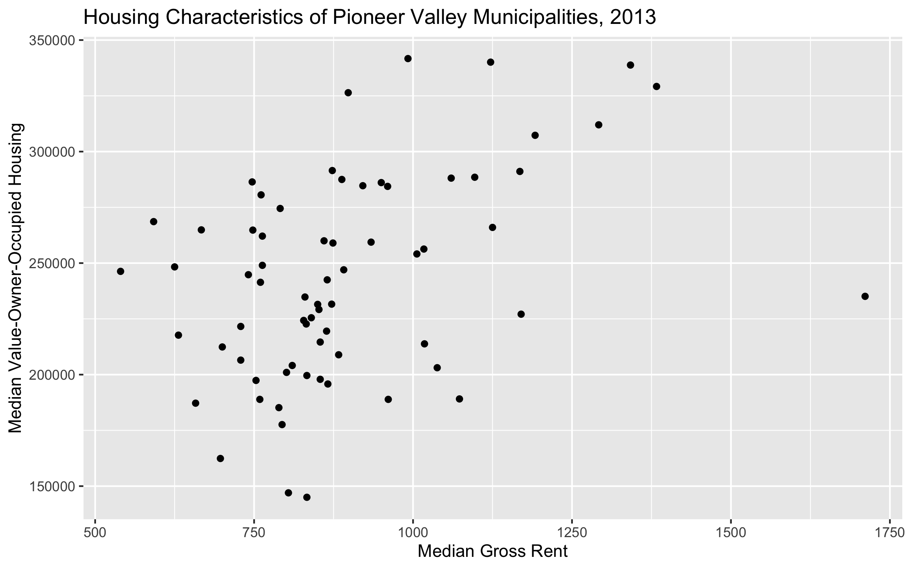
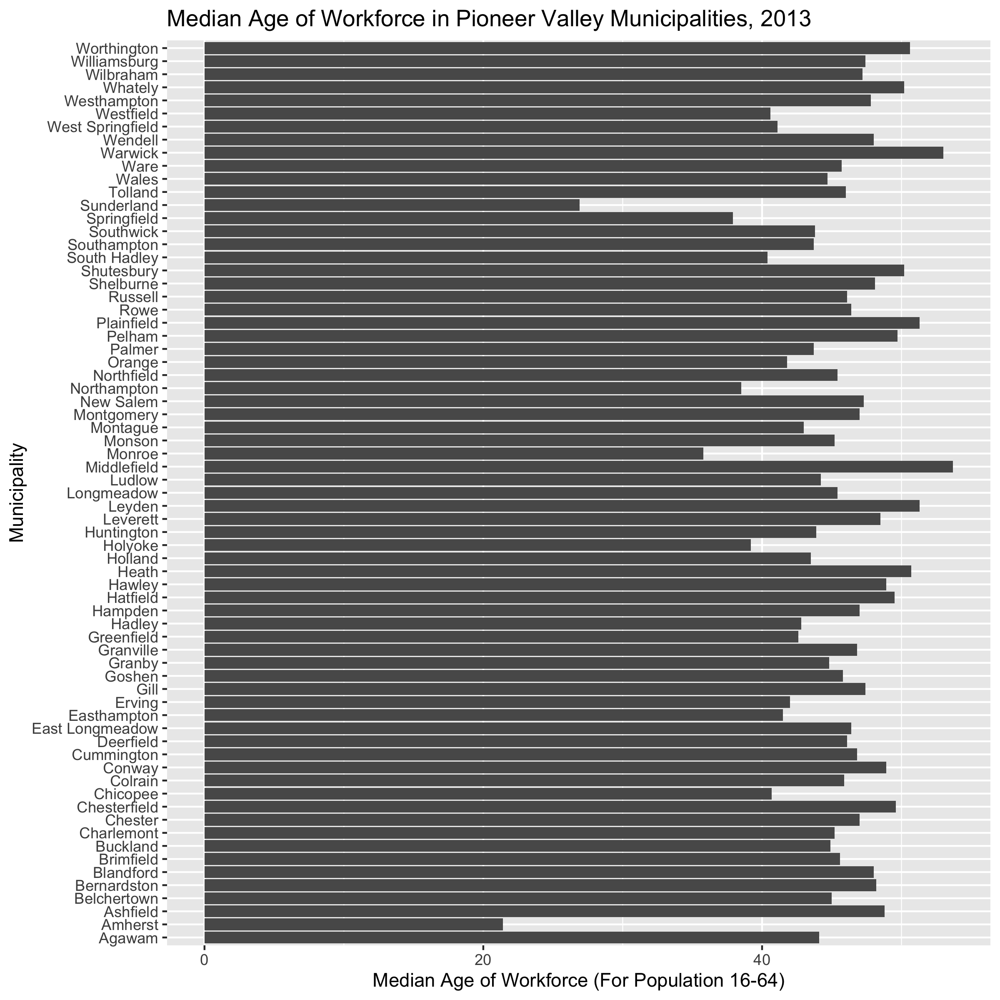
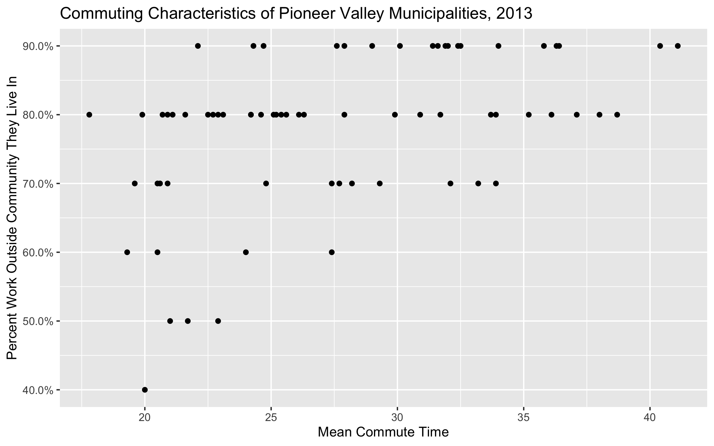

```{r}
#Load the ggplot library here.
library(ggplot2)
```

```{r}
pioneer_valley_2013 <- read.csv("https://raw.githubusercontent.com/SDS-192-Intro/sds-192-labs/main/Day7-GrammarGraphics/datasets/pioneer_valley_census_2013.csv", skip = 2)
pioneer_valley_2013_dictionary <- read.csv("https://raw.githubusercontent.com/SDS-192-Intro/sds-192-labs/main/Day7-GrammarGraphics/datasets/pioneer_valley_census_2013_dictionary.csv")
```

1. Check column names and values.

```{r}
#Check the column names for pioneer_valley_2013. View what column names refer to via pioneer_valley_2013_dictionary
names(pioneer_valley_2013)
#View(pioneer_valley_2013_dictionary)
```

2. Recreate this image using the `ggplot()` function. (Full size image in your images folder)



```{r, fig.height=5, fig.width=10}
ggplot(pioneer_valley_2013, 
       aes(x = CEN_MEDRENT, 
           y = CEN_MEDOWNVAL)) + 
  geom_point() +
  labs(title = "Housing Characteristics of Pioneer Valley Municipalities, 2013", 
       x = "Median Gross Rent",
       y = "Median Value-Owner-Occupied Housing") 
```

3. Recreate this image using the `ggplot()` function. (Full size image in your images folder)



```{r, fig.height=8, fig.width=8}
ggplot(pioneer_valley_2013, 
       aes(x = COMMUNITY, 
           y = MEDAGE_WF)) + 
  geom_col() +
  coord_flip() +
  labs(title = "Median Age of Workforce in Pioneer Valley Municipalities, 2013", 
       x = "Municipality",
       y = "Median Age of Workforce (For Population 16-64)") 
```

4. Recreate this image using the `ggplot()` function. (Full size image in your images folder)



> Hint: We need the function scale_y_continuous(), and the labels argument needs to be set to `scales::percent`. Check the help pages for this function to see how to format this!

```{r, fig.height=5, fig.width=8}
ggplot(pioneer_valley_2013, 
       aes(x = AVG_COMMUTETIME, 
           y = WORK_OUTCOMM)) + 
  geom_point() +
  scale_y_continuous(labels = scales::percent) +
  labs(title = "Commuting Characteristics of Pioneer Valley Municipalities, 2013", 
       x = "Mean Commute Time",
       y = "Percent Work Outside Community They Live In") 

```

5. Which of the following does each point on this plot indicate?

* A municipality

